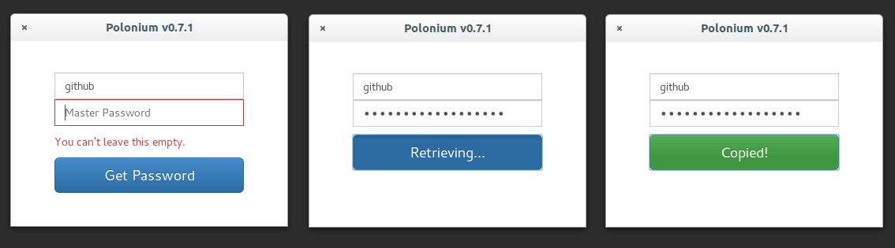

# Polonium (GUI) V0.5.1

 </img>

A node-webkit gui for [Polonium](https://github.com/rgrannell1/polonium), a stateless password manager.

### Requirements

* Ubuntu (tested on 14.10)
* xclip
* Node.js v0.11.13
* Node Webkit 0.8.6
* Bignum
* Is

### Installation

Polonium-GUI is not particularily easy to install on Ubuntu as certain packages required by node-webkit are unavailable.

To install Polonium-GUI, simply git clone.

```bash
git clone https://github.com/rgrannell1/polonium-gui.git
cd polonium-gui
```

To upgrade, run
```
cd

git clone https://github.com/rgrannell1/polonium-gui.git tmp-polonium-gui

cp rf tmp-polonium-gui polonium-gui
rm -rf tmp-polonium-gui
```

### -- Node Webkit

Now run execute.sh within that folder

```bash
sh execute.sh
```

This should download node-webkit to a folder in `~/polonium-gui'. Unfortunately
Node Webkit requires libudev.so.0, a library not available within Ubuntu. This
requires you to edit the nw executable manually. (instructions taken from 'daniel'
on [askubuntu](http://askubuntu.com/questions/288821/how-do-i-resolve-a-cannot-open-shared-object-file-libudev-so-0-error)).

```bash
cd ~/polonium-gui/node-webkit-v0.8.6-linux-x64
sudo apt-get install hexedit
sudo hexedit nw
```
Search for the string `libudev.so.0`:

* Press <kbd>Tab</kbd>.
* Press <kbd>Ctrl + S</kbd>.
* Type `libudev.so.0`.

Now change the 0 in `libudev.so.0` to 1 so the string is `libudev.so.1`, which is available to Ubuntu.

* Use the arrow keys to select the 0 in `libudev.so.0`.
* Press 1.

Now exit and save

* Press <kbd>Ctrl + x</kbd>.
* Press <kbd>y</kbd> to save.

The node-webkit executable should now work as expected.

### - Node

To install node.js on Ubuntu use

```bash
sudo add-apt-repository ppa:chris-lea/node.js
sudo apt-get update
sudo apt-get install nodejs
```


### - Polonium GUI

To add a launcher icon

```bash
sudo cat ~/polonium-gui/launcher.txt >> ~/.local/share/applications/polonium.desktop
```

You may need to restart your session by hitting <kbd>Alt + F2</kbd> and entering 'r'.

### Licence

The MIT License

Copyright (c) 2014 Ryan Grannell

Permission is hereby granted, free of charge, to any person obtaining a copy of this software and associated documentation files (the "Software"), to deal in the Software without restriction, including without limitation the rights to use, copy, modify, merge, publish, distribute, sublicense, and/or sell copies of the Software, and to permit persons to whom the Software is furnished to do so, subject to the following conditions:

The above copyright notice and this permission notice shall be included in all copies or substantial portions of the Software.

THE SOFTWARE IS PROVIDED "AS IS", WITHOUT WARRANTY OF ANY KIND, EXPRESS OR IMPLIED, INCLUDING BUT NOT LIMITED TO THE WARRANTIES OF MERCHANTABILITY, FITNESS FOR A PARTICULAR PURPOSE AND NONINFRINGEMENT. IN NO EVENT SHALL THE AUTHORS OR COPYRIGHT HOLDERS BE LIABLE FOR ANY CLAIM, DAMAGES OR OTHER LIABILITY, WHETHER IN AN ACTION OF CONTRACT, TORT OR OTHERWISE, ARISING FROM, OUT OF OR IN CONNECTION WITH THE SOFTWARE OR THE USE OR OTHER DEALINGS IN THE SOFTWARE.

### Versioning

Versioning complies with the Semantic Versioning 2.0.0 standard.

http://semver.org/
